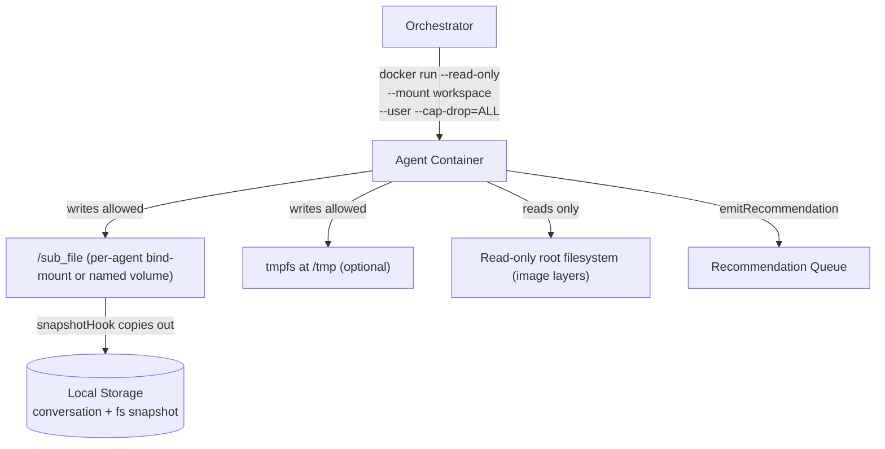

# Agent Write Isolation

## Metadata

- System type: `flow`

## System Intent

- What this is: The set of Docker and Linux primitives used to confine an agent container so it can only write to its own `/sub_file` workspace and cannot mutate the host filesystem, other containers' workspaces, or system paths. This is the enforcement layer underneath the Agent Environment component described in `plans/02_agent_environment_plan.md`.

## Mermaid Diagram



## Flows

### Flow: `startAgent`
- Test files: _not yet implemented_
- Core files: _not yet implemented_

#### Types

```txt
AgentLaunchConfig {
  agentId: string (required, unique per agent instance — used in volume name)
  workspaceHostPath: string (required, absolute host path for the per-agent bind-mount, e.g. /data/agents/<agentId>)
  image: string (required, OCI image reference)
  prompt: string (required, passed as env var or mounted file)
  alertDetails: object (required, passed as env var or mounted file)
}
```

#### Paths

| path | input | output | path-type | notes |
| --- | --- | --- | --- | --- |
| `startAgent.success` | `AgentLaunchConfig` | running container id | `happy path` | container starts with write isolation enforced |
| `startAgent.volume-collision` | `AgentLaunchConfig` with duplicate agentId | error | `error` | two agents must never share a workspace volume; agentId must be globally unique per run |

#### Pseudocode

```
// Orchestrator calls docker run with the following flags every time it spawns an agent.
// All flags are required for isolation; omitting any one of them weakens the guarantee.

docker run \
  --read-only \                                        // (1) root FS is read-only
  --mount type=bind,src=/data/agents/<agentId>,dst=/sub_file \  // (2) one writable path only
  --mount type=tmpfs,dst=/tmp \                        // (3) tools that need /tmp still work
  --user <nonRootUID>:<nonRootGID> \                   // (4) non-root in container
  --cap-drop=ALL \                                     // (5) drop every Linux capability
  --security-opt no-new-privileges \                   // (6) block privilege escalation
  --network <agentNetwork> \                           // (7) per-agent or isolated network
  <image>
```

---

### Flow: `snapshotHook`
- Test files: _not yet implemented_
- Core files: _not yet implemented_

#### Types

```txt
SnapshotRequest {
  agentId: string (required)
  workspaceHostPath: string (required, same path used in startAgent)
  destinationPath: string (required, path where snapshot archive is written)
}
```

#### Paths

| path | input | output | path-type | notes |
| --- | --- | --- | --- | --- |
| `snapshotHook.success` | `SnapshotRequest` | snapshot archive written to destinationPath | `happy path` | must run before container is removed |
| `snapshotHook.tmpfs-lost` | `SnapshotRequest` after container stop | /tmp contents lost | `error` | tmpfs is ephemeral; anything the agent wrote to /tmp and not /sub_file is gone after container stop |

#### Pseudocode

```
// The orchestrator's snapshotHook must copy /sub_file contents out
// BEFORE the container is removed, because the bind-mount source is
// on the host but any in-container state beyond that is gone on removal.

// Step 1: signal or wait for agent to finish
// Step 2: while container is still running or stopped (not removed):
tar -czf /snapshots/<agentId>.tar.gz -C /data/agents/<agentId> .

// Step 3: persist archive to Local Storage
// Step 4: docker rm <containerId>   (safe now — snapshot is already out)
```

---

### Flow: `emitRecommendation`
- Test files: _not yet implemented_
- Core files: _not yet implemented_

#### Types

```txt
Recommendation {
  agentId: string
  payload: object
}
```

#### Paths

| path | input | output | path-type | notes |
| --- | --- | --- | --- | --- |
| `emitRecommendation.success` | `Recommendation` | written to Recommendation Queue | `happy path` | agent writes to queue via network call only; it cannot write to the queue's filesystem directly |

---

## Concrete Isolation Mechanisms

### 1. Read-only root filesystem — `--read-only`

`docker run --read-only` sets the container's root filesystem to read-only at the Linux VFS layer. Every image layer is already read-only by the overlay filesystem; `--read-only` also makes the thin writable container layer read-only, so no path under `/` is writable unless an explicit mount overrides it.

**Failure mode:** many standard tools (`apt`, package managers, some logging libraries) write to `/var/`, `/run/`, `/etc/` at startup. These will fail with EROFS unless either (a) the image is purpose-built to avoid such writes, or (b) additional tmpfs mounts are provided for each path that legitimately needs writes.

### 2. Single writable bind-mount for `/sub_file`

```
--mount type=bind,source=/data/agents/<agentId>,target=/sub_file
```

- `source` is a directory the orchestrator created on the host before launching the container.
- `target` is `/sub_file` inside the container — the only path not covered by `--read-only`.
- The `source` directory is owned by the host account that runs Docker (or the remapped UID if `--userns-remap` is active).
- Each agent gets a distinct `agentId`, which is embedded in the source path, so two agents' workspaces are physically separate directories. A container cannot escape to a sibling agent's path because `--read-only` blocks writes everywhere except `/sub_file`, and `/sub_file` is mounted from the agent's own directory only.

**Naming convention:** `/data/agents/<agentId>` where `agentId` is a UUID or a globally unique token generated at alert time by the orchestrator.

### 3. tmpfs for /tmp

```
--mount type=tmpfs,dst=/tmp
```

Required when `--read-only` is set and any tool in the image writes to `/tmp`. tmpfs is backed by host RAM/swap, is private to the container, and is automatically freed when the container stops — it is not a path to host persistence. Anything the agent writes to `/tmp` and not to `/sub_file` is lost when the container stops; the `snapshotHook` must not rely on `/tmp` contents.

Optionally size-limit the tmpfs to prevent a runaway agent from filling host memory:

```
--mount type=tmpfs,dst=/tmp,tmpfs-size=256m
```

### 4. Non-root user — `--user`

```
--user 65534:65534   # nobody:nogroup, or a purpose-built UID baked into the image
```

Running as a non-root UID inside the container means that even if `--read-only` is somehow bypassed (e.g. via a misconfigured mount), the process does not have DAC override capability. The `/sub_file` bind-mount source directory on the host should be owned by this same UID (or by the remapped UID under `--userns-remap`), so the agent can write there but not elsewhere.

### 5. Capability dropping — `--cap-drop=ALL`

```
--cap-drop=ALL
```

Drops every Linux capability from the container's bounding set. Capabilities that are directly relevant to filesystem mutation and privilege escalation include:

| Capability | Relevance |
|---|---|
| `CAP_DAC_OVERRIDE` | bypass file read/write/execute permission checks |
| `CAP_DAC_READ_SEARCH` | bypass file read and directory search permission checks |
| `CAP_CHOWN` | change file ownership |
| `CAP_FOWNER` | bypass permission checks for operations that require file ownership |
| `CAP_SYS_ADMIN` | mount filesystems, manipulate namespaces — extremely broad |
| `CAP_SETUID` / `CAP_SETGID` | change UID/GID |
| `CAP_MKNOD` | create special device files |

Dropping all capabilities means the agent process cannot re-gain write access to the read-only root filesystem even if it contains a setuid binary.

If a specific capability is needed (e.g. `CAP_NET_BIND_SERVICE` to bind a low port), add it back explicitly with `--cap-add=<CAP>` after `--cap-drop=ALL`.

### 6. No new privileges — `--security-opt no-new-privileges`

```
--security-opt no-new-privileges
```

Sets the `no_new_privs` bit on the container's init process via `prctl(PR_SET_NO_NEW_PRIVS, 1)`. This prevents any child process from gaining privileges via setuid/setgid executables or file capabilities, even if such binaries exist in the image. This is a Linux kernel guarantee, not just a Docker policy.

### 7. seccomp profile (defense-in-depth)

Docker's default seccomp profile (applied unless `--security-opt seccomp=unconfined`) already blocks ~44 syscalls. For tighter filesystem write confinement, a custom profile can additionally block:

- `mount` / `umount2` — prevent mounting new filesystems
- `pivot_root` / `chroot` — prevent escaping the container root
- `open` / `openat` with `O_WRONLY` or `O_RDWR` on paths outside `/sub_file` — this is hard to express in seccomp alone (seccomp is syscall-argument-aware but not path-aware); path-based enforcement is better left to AppArmor/SELinux.
- `ptrace` — prevent a child process from injecting writes into another process

Apply a custom profile:

```
--security-opt seccomp=/path/to/agent-seccomp.json
```

### 8. AppArmor profile (path-aware, defense-in-depth)

AppArmor profiles can express path-based write rules directly. A minimal agent profile:

```
# /etc/apparmor.d/agent-container
profile agent-container flags=(attach_disconnected,mediate_deleted) {
  # deny all writes by default
  deny /** w,
  deny /** a,

  # allow writes only under /sub_file
  /sub_file/** rw,

  # allow writes to tmpfs /tmp
  /tmp/** rw,

  # allow reads everywhere
  /** r,
  /** ix,   # allow execute for read-only binaries
}
```

Apply to a container:

```
--security-opt apparmor=agent-container
```

SELinux provides equivalent path-based labeling via type enforcement; the principle is the same — label `/sub_file` with a type that the agent domain is allowed to write, deny writes to all other types.

### 9. User namespaces — `--userns-remap`

```
# /etc/docker/daemon.json
{
  "userns-remap": "default"
}
```

When `userns-remap` is enabled on the Docker daemon, the in-container UID 0 maps to an unprivileged host UID (e.g. `165536`). This means:

- Even if the container process escapes to the host, it runs as an unprivileged user.
- The bind-mount source directory `/data/agents/<agentId>` must be owned by the remapped UID on the host so the container can write to it.
- All other host paths are owned by UIDs outside the container's mapped range, so the container process cannot write them even if it somehow escapes.

`userns-remap` requires the Docker daemon to be configured before containers are started; it applies globally to all containers on that daemon.

### 10. Do not bind-mount the Docker socket

Never include `-v /var/run/docker.sock:/var/run/docker.sock` in the agent's `docker run` command. Access to the Docker socket is equivalent to root on the host — an agent with socket access can spawn new containers, bind-mount arbitrary host paths, and escape all isolation described here.

### 11. Do not bind-mount host system paths

Avoid any of the following in the agent's `docker run`:

- `-v /:/hostroot` or similar whole-host mounts
- `-v /etc:/etc` or `-v /proc:/proc` — /proc is available in a read-only form by default; re-mounting writable would allow kernel parameter tampering
- `-v /data/agents:/data/agents` — would expose all agents' workspaces; mount only `/data/agents/<agentId>`

## Trade-offs and Failure Modes

| Scenario | Impact | Mitigation |
|---|---|---|
| `--read-only` breaks tool startup writes to `/var/run`, `/run`, `/etc/ld.so.cache` | container fails to start | add targeted tmpfs mounts for each problematic path, or rebuild image to avoid these writes |
| tmpfs `/tmp` is ephemeral | agent work in `/tmp` is lost on container stop | agent must write all persistent state to `/sub_file`; snapshotHook must run before `docker rm` |
| snapshotHook runs after `docker rm` | snapshot is empty | orchestrator must gate `docker rm` on snapshotHook completion |
| per-agent directory not created before `docker run` | bind-mount source created by Docker as root-owned directory, agent (non-root UID) cannot write | orchestrator must `mkdir -p /data/agents/<agentId> && chown <agentUID> /data/agents/<agentId>` before `docker run` |
| agentId collision (two agents get the same ID) | agents share a workspace, writes interleave | orchestrator must generate UUIDs and check for directory existence before launch |
| AppArmor/SELinux not loaded on host | security-opt flags are silently ignored | verify with `docker info | grep Security` before deploying; treat absence as a configuration error |
| `--cap-drop=ALL` breaks a needed syscall | container crashes | identify required capabilities in staging and add back with `--cap-add=<CAP>` explicitly |
| image contains setuid binaries | `CAP_SETUID` may be usable if capabilities not dropped | `--cap-drop=ALL` + `--security-opt no-new-privileges` closes this path |
| agent writes to its own `/sub_file` then reads sibling agent data via a shared volume | cross-agent read contamination | do not share any volume between agents; each agentId maps to exactly one directory |

## Mapping to Plan Flows

| Plan flow | Isolation hook |
|---|---|
| `startAgent` | Orchestrator calls `docker run` with all flags above. Host directory `/data/agents/<agentId>` is created and chowned before launch. |
| `fetchMachineInfo` | Agent reads source code + logs via outbound network call. Read-only root FS does not affect outbound network reads. Agent cannot write the fetched data anywhere except `/sub_file`. |
| `snapshotHook` | Orchestrator tars `/data/agents/<agentId>` (the bind-mount source on the host) into `/snapshots/<agentId>.tar.gz` while the container is stopped but not yet removed. The archive contains the full conversation + filesystem state the agent wrote. `docker rm` happens after the archive is confirmed written. |
| `emitRecommendation` | Agent writes the recommendation via an outbound network call (e.g. HTTP POST to the Recommendation Queue service). The queue's filesystem is not accessible from the agent container. |

## Logs

| Source | Location |
|--------|----------|
| container stdout/stderr | `docker logs <containerId>` or forwarded to host logging driver |
| orchestrator launch audit | host log file or orchestrator service log (path TBD) |

## Deployment

- Mechanism: `docker`
- Deploy command:
  ```bash
  # Example minimal startAgent invocation (orchestrator fills in variables at runtime)
  docker run \
    --read-only \
    --mount type=bind,source=/data/agents/${AGENT_ID},target=/sub_file \
    --mount type=tmpfs,dst=/tmp,tmpfs-size=256m \
    --user 65534:65534 \
    --cap-drop=ALL \
    --security-opt no-new-privileges \
    --rm \
    ${AGENT_IMAGE}
  ```
- Notes: `--rm` auto-removes the container after exit; the snapshotHook must complete (archive written to `/snapshots/`) before this flag causes removal. If the orchestrator needs to guarantee ordering, omit `--rm` and call `docker rm` explicitly after snapshotHook confirms success.
