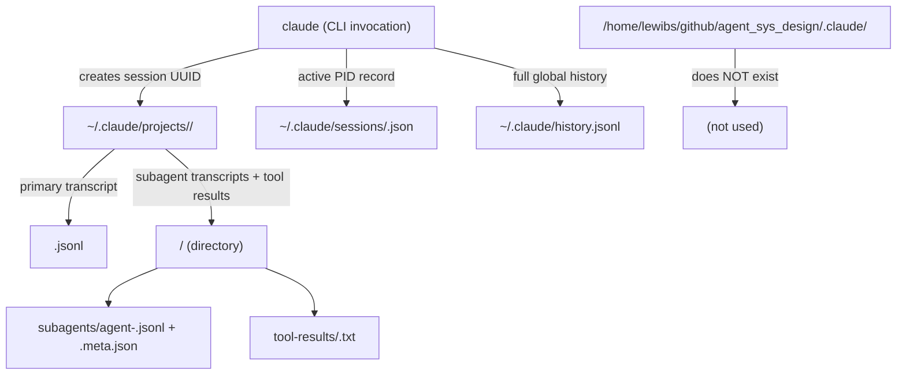

# Claude Resume Data Storage

## Metadata

- System type: `library`

## System Intent

- What this is: The on-disk layout that Claude Code uses to persist session/conversation transcripts, enabling `claude --resume` to replay or continue previous sessions. This documents exactly where those files live for the project at `/home/lewibs/github/agent_sys_design`.

## Mermaid Diagram



## Flows

### Flow: `session-transcript-write`
- Core files: `~/.claude/projects/-home-lewibs-github-agent-sys-design/`

#### Types

```txt
SessionRecord (one JSON object per line in *.jsonl):
  type: string  — "mode" | "permission-mode" | "file-history-snapshot" | "user" | assistant turn type
  sessionId: string (UUID)
  parentUuid: string | null
  uuid: string
  message: object  — role + content payload
  cwd: string  — absolute path of working directory at turn time
  timestamp: string (ISO-8601)

ActiveSessionPointer (~/.claude/sessions/<pid>.json):
  pid: number
  sessionId: string (UUID)
  cwd: string
  startedAt: number (epoch ms)
  version: string
  kind: string  — "interactive"
  entrypoint: string  — "cli"
  status: string  — "busy" | "idle"
  updatedAt: number

SubagentMeta (subagents/*.meta.json):
  agentType: string
  description: string
  toolUseId: string
```

#### Paths

| path | input | output | path-type | notes |
| --- | --- | --- | --- | --- |
| `session-transcript-write.turn` | user or assistant message | appended line in `<session-uuid>.jsonl` | happy path | one JSON object per newline |
| `session-transcript-write.subagent` | spawned sub-agent invocation | `subagents/agent-<id>.jsonl` + `.meta.json` | happy path | only created when sub-agents are used |
| `session-transcript-write.tool-result` | large tool output | `tool-results/<tool-use-id>.txt` | happy path | files written when result is too large for inline JSONL |

#### Pseudocode

```
on_session_start(cwd):
  project_key = absolute_path_to_key(cwd)           # "/" → "-", "_" → "-"
  project_dir = ~/.claude/projects/<project_key>/
  session_uuid = new_uuid()
  transcript_file = project_dir/<session_uuid>.jsonl
  active_pointer = ~/.claude/sessions/<pid>.json

on_turn(message):
  append_jsonl_line(transcript_file, message)

on_subagent_spawn(agent_id, tool_use_id):
  subagent_dir = project_dir/<session_uuid>/subagents/
  write subagent_dir/agent-<agent_id>.jsonl   # subagent conversation
  write subagent_dir/agent-<agent_id>.meta.json
```

## Concrete Evidence (this project)

The project working directory `/home/lewibs/github/agent_sys_design` maps to:

```
~/.claude/projects/-home-lewibs-github-agent-sys-design/
```

Path encoding rule: each `/` separator becomes `-`, underscores in path components also become `-` (confirmed: `agent_sys_design` → `agent-sys-design`). The leading `/` is dropped and replaced with a leading `-`.

Files present as of 2026-06-14:

```
~/.claude/projects/-home-lewibs-github-agent-sys-design/
  444c9418-bab6-409f-a51d-fb8d7b937d2e.jsonl          (48 lines)
  917ad10c-f72e-40eb-9bef-460aba7f89a4.jsonl          (9 lines)
  d657cd1f-51e6-4975-a497-69e43b313007.jsonl          (186 lines)
  d657cd1f-51e6-4975-a497-69e43b313007/
    subagents/   — agent-*.jsonl + agent-*.meta.json
    tool-results/ — <tool-use-id>.txt
  edd0ce6d-3b1e-4dab-ae92-290326db0e43.jsonl          (active session — line count grows as the conversation continues)
  edd0ce6d-3b1e-4dab-ae92-290326db0e43/
    subagents/   — created lazily when sub-agents are spawned; agent-<id>.jsonl + agent-<id>.meta.json per sub-agent
    tool-results/ — created lazily when large tool outputs are spilled; <tool-use-id>.txt per result
  f22d785f-b970-4b52-87fc-f22326de482f.jsonl          (258 lines)
  f669e4e3-9013-4775-89ec-2cef7f81402c.jsonl          (150 lines)
  f669e4e3-9013-4775-89ec-2cef7f81402c/
    subagents/
    tool-results/
  memory/  — (empty)
```

The project's own directory (`/home/lewibs/github/agent_sys_design/.claude/`) does **not exist**. No resume/session data is written inside the project tree.

The active session pointer is at:

```
~/.claude/sessions/78487.json
```

Content: `{"pid":78487,"sessionId":"edd0ce6d-3b1e-4dab-ae92-290326db0e43","cwd":"/home/lewibs/github/agent_sys_design",...}`

A global, cross-project, append-only command history that grows continuously over time is maintained at:

```
~/.claude/history.jsonl
```

## Logs

| Source | Location |
|--------|----------|
| Session transcripts | `~/.claude/projects/<encoded-cwd>/<session-uuid>.jsonl` |
| Subagent transcripts | `~/.claude/projects/<encoded-cwd>/<session-uuid>/subagents/agent-<id>.jsonl` |
| Tool result blobs | `~/.claude/projects/<encoded-cwd>/<session-uuid>/tool-results/<tool-use-id>.txt` |
| Active session pointers | `~/.claude/sessions/<pid>.json` |
| Global cross-project history | `~/.claude/history.jsonl` |
| File edit backups | `~/.claude/file-history/<session-uuid>/` |
| Session environment snapshots | `~/.claude/session-env/<session-uuid>/` |

## Deployment

- Mechanism: `local only`
- Deploy command: n/a — written automatically by the `claude` CLI process on every turn
- Notes: All paths are under `~/.claude/` (user home). Nothing is written into the project working directory. The `--resume <session-uuid>` flag reads the corresponding `.jsonl` file from the project-keyed subdirectory.
