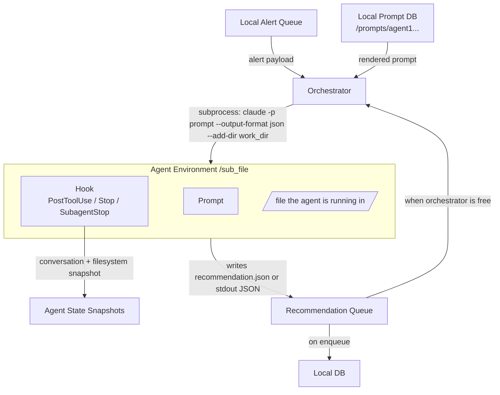

# Programmatic Agent Triggering

## Metadata

- System type: `flow`

## System Intent

- What this is: The mechanism by which the orchestrator deterministically spawns a Claude agent from code (headless, non-interactive), supplies it with a rendered prompt (from the prompt DB plus alert details), runs it in an isolated `/sub_file` directory with lifecycle hooks, and receives a recommendation back into the recommendation queue.
- Primary caller: The orchestrator, which consumes high-level alerts from the local alert queue, selects a prompt from the local prompt DB, and shells out to or calls an SDK to create the agent process.

## Mermaid Diagram



## Flows

### Flow: `spawnAgent`

- Core files: orchestrator spawn logic (to be implemented)
- Test files: none yet

#### Types

```txt
AlertPayload {
  id: string (required)
  source: string
  details: object (alert-specific fields)
}

PromptTemplate {
  id: string (required)
  text: string (prompt body from local prompt DB)
}

SpawnInput {
  prompt: string (rendered: PromptTemplate.text + AlertPayload as JSON block)
  work_dir: string (absolute path to per-agent /sub_file directory)
  allowed_tools: string (comma-separated, e.g. "Read,Edit,Bash,Write")
}

AgentStdoutJSON {           -- returned when --output-format json
  result: string            (agent's final text output / recommendation)
  session_id: string        (use with --resume for continuation)
  usage: object             (token counts)
  total_cost_usd: float
}

Recommendation {
  alert_id: string
  recommendation: string
  session_id: string
}
```

#### Paths

| path | input | output | path-type | notes |
| --- | --- | --- | --- | --- |
| `spawnAgent.success` | `SpawnInput` | `AgentStdoutJSON` (stdout) | happy path | Parse stdout as JSON; extract result field as recommendation |
| `spawnAgent.structured` | `SpawnInput` + JSON schema | `AgentStdoutJSON` with result matching schema | happy path | Use `--json-schema` flag for strict output contracts |
| `spawnAgent.resume` | `session_id` + new prompt | `AgentStdoutJSON` | happy path | Pass `--resume <session_id>` to continue a prior session |
| `spawnAgent.agent-error` | `SpawnInput` | non-zero exit code + stderr | error | Agent process exited with error; inspect stderr |
| `spawnAgent.parse-error` | `AgentStdoutJSON` | JSON decode failure | error | stdout not valid JSON; fall back to raw text result |

#### Pseudocode

```
# Option 1 (chosen): Claude Code CLI headless — spawn_agent()

def spawn_agent(prompt: str, alert: dict, work_dir: str) -> dict:
    full_prompt = prompt + "\n\n## Alert\n" + json.dumps(alert)
    proc = subprocess.run(
        ["claude", "-p", full_prompt,
         "--output-format", "json",
         "--allowedTools", "Read,Edit,Bash,Write",
         "--add-dir", work_dir,
         "--bare"],          # skip MCP/plugin discovery — deterministic
        cwd=work_dir,
        capture_output=True,
        text=True,
    )
    result = json.loads(proc.stdout)
    # result = {result, session_id, usage, total_cost_usd}
    return result

# Orchestrator loop
while True:
    alert = alert_queue.get()
    prompt_template = prompt_db.fetch(alert.type)
    work_dir = create_sub_file_dir(alert.id)   # /sub_file/<alert_id>/
    output = spawn_agent(prompt_template, alert, work_dir)
    recommendation = {
        "alert_id": alert.id,
        "recommendation": output["result"],
        "session_id": output["session_id"],
    }
    recommendation_queue.put(recommendation)   # triggers write to local DB
```

---

## Recommended Approach: Option 1 — Claude Code CLI Headless Mode

### Why Option 1 fits this design

The orchestrator design requires:
1. An agent that runs in a specific local filesystem directory (`/sub_file`) — the CLI `--add-dir` flag and `cwd` parameter set this exactly.
2. Lifecycle hooks (`PostToolUse`, `Stop`, `SubagentStop`) that fire on agent events — these hooks are a Claude Code CLI feature; they do not exist in the Managed Agents SDK or raw Messages API.
3. A Stop hook that snapshots the conversation and filesystem to local storage — only possible when the agent is a local CLI process with a controllable working directory.
4. No cloud sandbox dependency — the CLI runs fully local.
5. Low orchestration overhead — a single `subprocess.run` call; no session management or streaming infrastructure.

### All CLI flags used

| Flag | Purpose |
| --- | --- |
| `-p` / `--print` | Non-interactive mode; runs to completion and exits |
| `--output-format json` | Returns `{result, session_id, usage, total_cost_usd}` on stdout |
| `--json-schema '<schema>'` | Forces structured output matching a JSON schema (use for strict recommendation contracts) |
| `--allowedTools "Read,Edit,Bash,Write"` | Pre-approve tools; agent does not prompt for permission |
| `--permission-mode acceptEdits` | Alternative to allowedTools for broader edit permissions |
| `--add-dir <path>` | Grants agent access to the specified directory |
| `cwd=work_dir` | Sets agent's working directory to the per-alert `/sub_file` |
| `--bare` | Skip MCP/plugin auto-discovery — faster, deterministic, recommended for production |
| `--append-system-prompt "<text>"` | Inject orchestrator-level context into the system prompt |
| `--resume <session_id>` | Resume a specific prior session (session_id from previous json output) |
| `--continue` | Resume the most recent session |

### Python spawn example

```python
import subprocess, json

def spawn_agent(prompt: str, alert: dict, work_dir: str) -> dict:
    full_prompt = f"{prompt}\n\n## Alert\n{json.dumps(alert)}"
    proc = subprocess.run(
        ["claude", "-p", full_prompt,
         "--output-format", "json",
         "--allowedTools", "Read,Edit,Bash,Write",
         "--add-dir", work_dir,
         "--bare"],
        cwd=work_dir,
        capture_output=True,
        text=True,
    )
    return json.loads(proc.stdout)  # {result, session_id, usage, total_cost_usd}
```

### Session resumption (bash example)

```bash
session_id=$(claude -p "Task 1" --output-format json | jq -r '.session_id')
claude -p "Task 2" --resume "$session_id"
```

### Stdin piping (alternative input method)

```bash
cat alert_details.txt | claude -p 'Analyze this alert and produce a recommendation' --output-format json
```

---

## Design Component Mapping

| Design component | CLI mechanism |
| --- | --- |
| **Orchestrator** | Python process calling `subprocess.run(["claude", "-p", ...])` |
| **Agent /sub_file directory** | `cwd=work_dir` + `--add-dir work_dir`; each alert gets its own directory at `/sub_file/<alert_id>/` |
| **Hook / state snapshot** | Claude Code CLI `Stop` hook fires when the agent process finishes; hook script reads the agent's working directory and conversation log, writes snapshot to local storage |
| **Recommendation queue** | Agent writes its output to stdout (captured by `proc.stdout`) or to a known file in `work_dir`; orchestrator parses and enqueues after process exits; queue write triggers local DB persistence |
| **Prompt DB** | Local directory (`/prompts/agent1...`); orchestrator fetches prompt text by alert type, concatenates with alert details, passes as the `-p` argument |
| **Session continuity** | `session_id` from `AgentStdoutJSON` stored in local DB; pass `--resume <session_id>` to re-enter a prior agent conversation |

---

## Alternative Approaches (not chosen)

### Option 2: Managed Agents SDK

Install: `pip install anthropic`

```python
from anthropic import Anthropic
client = Anthropic()

agent = client.beta.agents.create(
    name="alert-responder",
    model="claude-opus-4-8",
    system="You are an alert response agent.",
    tools=[{"type": "agent_toolset_20260401"}],
)
environment = client.beta.environments.create(name="alert-env", config={})
session = client.beta.sessions.create(
    agent_id=agent.id,
    environment_id=environment.id,
)
client.beta.sessions.events.send(
    session.id,
    events=[{"type": "user.message", "content": [{"type": "text", "text": prompt}]}],
)
# Stream until session.status_idle
for event in client.beta.sessions.events.stream(session.id):
    if event.type == "agent.message":
        recommendation = event.content[0].text
    if event.type == "session.status_idle":
        break
```

Trade-offs vs Option 1:
- Runs in Anthropic-managed cloud sandbox, not local `/sub_file`
- Lifecycle hooks (`Stop`, `PostToolUse`) are not available
- Supports built-in multiagent coordinator: `multiagent={"type":"coordinator","agents":[{"type":"agent","id":...}]}` (max 20 unique agents, 25 concurrent threads)
- Useful if cloud isolation or managed multiagent delegation is needed in the future

### Option 3: Raw Messages API with manual tool-use loop

Install: `pip install anthropic`

```python
from anthropic import Anthropic
client = Anthropic()

messages = [{"role": "user", "content": prompt}]
while True:
    response = client.messages.create(
        model="claude-opus-4-8",
        max_tokens=8096,
        system="You are an alert response agent.",
        tools=tools,
        messages=messages,
    )
    if response.stop_reason == "end_turn":
        recommendation = response.content[0].text
        break
    elif response.stop_reason == "tool_use":
        messages.append({"role": "assistant", "content": response.content})
        tool_results = []
        for block in response.content:
            if block.type == "tool_use":
                result = execute_tool(block.name, block.input)
                tool_results.append({
                    "type": "tool_result",
                    "tool_use_id": block.id,
                    "content": result,
                })
        messages.append({"role": "user", "content": tool_results})
```

Trade-offs vs Option 1:
- Full control over the agentic loop and tool execution
- Requires implementing the entire tool dispatch and loop yourself
- No hooks, no working-directory isolation
- Use only if custom loop logic (e.g., custom tool routing, non-standard retry) is required

### Comparison table

| Method | Entry point | Effort | Local /sub_file support | Hooks | Best for |
| --- | --- | --- | --- | --- | --- |
| Claude Code CLI `-p` | `claude -p "prompt"` | Low | Yes — `cwd` + `--add-dir` | Yes — Stop, PostToolUse | One-off/local agents in a dir, hooks, CI (our design) |
| Managed Agents SDK | `client.beta.agents.create()` + sessions | Medium | No — cloud sandbox | No | Durable cloud agents, managed multiagent |
| Messages API loop | `client.messages.create()` + manual loop | High | No | No | Custom loop control |

---

## Logs

| Source | Location |
|--------|----------|
| Agent stdout (recommendation) | Captured via `proc.stdout` in orchestrator |
| Agent stderr (errors) | Captured via `proc.stderr` in orchestrator |
| Hook execution | Hook script writes to local storage path configured in `.claude/settings.json` hooks config |
| Orchestrator process | Local log file or stdout of orchestrator process |

## Deployment

- Mechanism: `local only`
- Prerequisites:
  ```bash
  # Install Claude Code CLI
  npm install -g @anthropic/claude-code
  # Or for SDK approaches
  pip install anthropic
  export ANTHROPIC_API_KEY=<your-key>
  ```
- Notes:
  - The `claude` CLI binary must be on `PATH` when the orchestrator process runs.
  - `--bare` is recommended in production to skip MCP/plugin discovery and ensure deterministic behavior.
  - Per-agent work directories (`/sub_file/<alert_id>/`) must be created by the orchestrator before spawning.
  - Hook scripts are registered in the Claude Code settings (`~/.claude/settings.json` or project-level `.claude/settings.json`) under the `hooks` key with event types `PostToolUse`, `Stop`, or `SubagentStop`.
  - Current model IDs (June 2026): `claude-opus-4-8` (latest), `claude-opus-4-7`, `claude-opus-4-6`, `claude-sonnet-4-6`, `claude-sonnet-4-5`, `claude-haiku-4-5`.
