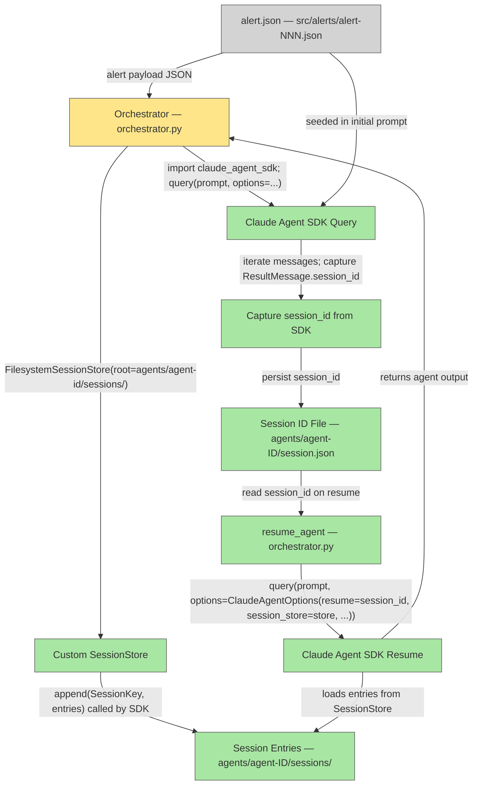

# Plan — Agent Environment / Runtime (Claude Agent SDK Session Persistence)

## System Intent

- **What is being built**: A lightweight Python runtime that spawns and resumes Claude Code sub-agents using the Claude Agent SDK's session persistence feature. The runtime seeds each agent with an alert.json in its context at spawn time, captures and persists the session_id to external storage (a custom FilesystemSessionStore rooted in the agent's own folder), and allows crash-recovered agents to resume their prior conversation.
- **Primary consumer(s)**: The orchestrator (`orchestrator.py`), which calls `spawn_agent()` to start a fresh sub-agent seeded with an alert, and `resume_agent()` when a crashed agent needs to resume.
- **Boundary (black-box scope only)**: The Claude Agent SDK (`claude_agent_sdk` Python package) and the Anthropic API. The plan documents how the orchestrator calls the SDK; the SDK and API internals are not modified.

## Critical Context (Prior Verified Investigations)

### Session Persistence via Claude Agent SDK

Per official Agent SDK documentation (https://code.claude.com/docs/en/agent-sdk/sessions and .../session-storage):

- **Core SDK call**: `query(prompt=..., options=ClaudeAgentOptions(...))` returns an async-iterable of messages, including a `ResultMessage` containing `session_id`.
- **Resume**: Pass `options=ClaudeAgentOptions(resume=session_id, ...)` to continue a prior conversation.
- **External storage (SessionStore)**: The SDK's `SessionStore` Protocol allows custom backends. A SessionStore implements two required async methods:
  - `async def append(self, key: SessionKey, entries: list[SessionStoreEntry]) -> None` — persist new entries
  - `async def load(self, key: SessionKey) -> list[SessionStoreEntry] | None` — restore entries (return None if unknown key)
  - Optional: `list_subkeys()` for restoring subagent transcripts on resume
- **SessionKey** is a TypedDict: `{project_key: str, session_id: str, subpath?: str}`. The subpath field is set for subagent transcripts (opaque, e.g., "subagents/agent-<id>"); omitted for main transcript.
- **Dual-write (mirror mode)**: The SDK writes locally to JSONL first, then forwards each batch to `append()`. The local copy is under `CLAUDE_CONFIG_DIR` (via `options.env`); to make it ephemeral, point that to a temp dir.
- **Mirror resilience**: On `append()` failure, the SDK emits a `{type:"system", subtype:"mirror_error"}` message and continues (local copy remains durable); failed batches are not retried.
- **Constraints**: `session_store` cannot combine with `persistSession: false` or `enableFileCheckpointing`, or the SDK will throw.
- **Testing**: The SDK ships `InMemorySessionStore` for dev/testing and a Python conformance suite (`from claude_agent_sdk.testing import run_session_store_conformance`).

### Design Implication: Where Transcripts Live

With a FilesystemSessionStore rooted at `./agents/<agent-id>/sessions/`, the transcript is persisted **within the agent's own folder**, not scattered across the host's `~/.claude/`. This makes spawn+resume self-contained and host-independent: the session_id is captured in `./agents/<agent-id>/session.json`, and all conversation history lives in `./agents/<agent-id>/sessions/` under the custom store.

## Stage Gate Tracker

- [x] Stage 1 Mermaid approved
- [x] Stage 2 Flows approved

## Mermaid Diagram



## Flows

- Flow naming rule: `### Flow: \`<flowname>\``
- `N/A` for test files means explicit no-test-required waiver (not a missing mapping).

### Global Types

```txt
StandardError {
  message: string (human-readable description of what went wrong)
}

AgentId {
  value: string  — UUID, unique per alert run
}

SessionKey {
  project_key: string     — typically "orchestrator" or similar; groups related agents
  session_id: string      — UUID returned by SDK query
  subpath?: string        — optional, for subagent transcripts; omitted for main
}

SessionStoreEntry {
  # Opaque JSON-safe objects; the SDK defines the structure
  # Persist in order; return deep-equal entries in same order from load()
}

SpawnOutput {
  agent_output:  string   — the agent's final text output / recommendation
  session_id:    string   — UUID captured from ResultMessage.session_id
}

ResumeOutput {
  agent_output:  string   — the agent's continuation output
  session_id:    string   — session_id (may be same as input, or updated by SDK)
}
```

---

### Flow: `spawnAgent`
- Test files: `tests/test_agent_environment.py`
- Core files: `orchestrator.py` — `spawn_agent()`, `FilesystemSessionStore` class

#### Description

Start a fresh Claude Agent SDK query, seeded with an alert in the initial prompt. Attach a FilesystemSessionStore rooted in the agent's folder. Iterate through SDK messages until a ResultMessage arrives, extract the session_id, and persist it to `agents/<agent-id>/session.json`.

#### Types

```txt
SpawnInput {
  agent_id:  string  (required, UUID; used as folder name)
  alert:     dict    (required, parsed alert.json object)
  prompt:    string  (required, full rendered prompt: template + alert block)
}

SpawnOutput {
  agent_output: string   — agent's final text
  session_id:   string   — captured from ResultMessage.session_id
}
```

#### Paths

| path | input | output | path-type | notes |
| --- | --- | --- | --- | --- |
| `spawnAgent.success` | `SpawnInput` | `SpawnOutput` | happy path | agent folder created, SessionStore wired, SDK query runs to ResultMessage, session.json written |
| `spawnAgent.workdir-collision` | `SpawnInput` with existing agent_id | `StandardError` | error | agent_id collision; orchestrator must generate a fresh UUID and retry |
| `spawnAgent.session-store-error` | `SpawnInput` | `StandardError` | error | SessionStore.append() failed (mirror_error); logged but does not block completion (local copy is durable) |
| `spawnAgent.sdk-error` | `SpawnInput` | `StandardError` | error | SDK query raised exception or iteration terminated without ResultMessage |

#### Pseudocode

```
async def spawn_agent(input: SpawnInput) -> SpawnOutput:
    agent_dir = f"./agents/{input.agent_id}"
    
    # 1. Create agent's folder + sessions subfolder
    os.makedirs(agent_dir, exist_ok=False)  # fail if collision
    sessions_dir = f"{agent_dir}/sessions"
    os.makedirs(sessions_dir, exist_ok=True)
    
    # 2. Create FilesystemSessionStore rooted in agent folder
    store = FilesystemSessionStore(root=sessions_dir)
    
    # 3. Seed the alert into the prompt context
    full_prompt = f"{input.prompt}\\n\\n## Alert\\n{json.dumps(input.alert, indent=2)}"
    
    # 4. Query the SDK
    from claude_agent_sdk import query, ClaudeAgentOptions, ResultMessage
    options = ClaudeAgentOptions(
        session_store=store,
        # Optionally: env={ "CLAUDE_CONFIG_DIR": "/tmp/..." } for ephemeral local copy
    )
    
    session_id = None
    agent_output = None
    async for message in query(prompt=full_prompt, options=options):
        if isinstance(message, ResultMessage):
            agent_output = message.result
            session_id = message.session_id
            # Stop iterating; result marks end of conversation
            break
        elif message.type == "system" and message.subtype == "mirror_error":
            # Log but continue; local copy is durable
            logger.warning(f"SessionStore.append() failed: {message.error}")
    
    if not session_id:
        raise StandardError("SDK query did not return a ResultMessage with session_id")
    
    # 5. Persist session_id for crash-recovery
    session_file = f"{agent_dir}/session.json"
    with open(session_file, "w") as f:
        json.dump({"session_id": session_id}, f)
    
    return SpawnOutput(agent_output=agent_output, session_id=session_id)
```

---

### Flow: `resumeAgent`
- Test files: `tests/test_agent_environment.py`
- Core files: `orchestrator.py` — `resume_agent()`, `FilesystemSessionStore` class

#### Description

Load the persisted session_id from `agents/<agent-id>/session.json`, re-create the FilesystemSessionStore rooted in the agent's folder, and call the SDK with `resume=session_id`. The SDK loads prior conversation entries from the SessionStore and continues from where it left off.

#### Types

```txt
ResumeInput {
  agent_id:       string   (required, must match original spawn)
  resume_prompt:  string   (required, continuation prompt; e.g., "Continue from where you left off.")
}

ResumeOutput {
  agent_output: string   — agent's continuation output
  session_id:   string   — session_id from resumed conversation
}
```

#### Paths

| path | input | output | path-type | notes |
| --- | --- | --- | --- | --- |
| `resumeAgent.success` | `ResumeInput` | `ResumeOutput` | happy path | session.json found, SDK resumes with session_store, agent continues conversation |
| `resumeAgent.no-session` | `ResumeInput` with missing session.json | `StandardError` | error | cannot resume without persisted session_id |
| `resumeAgent.store-corrupted` | `ResumeInput` where SessionStore.load() returns incomplete/malformed entries | `StandardError` | error | conversation history was lost or corrupted on disk |
| `resumeAgent.sdk-error` | `ResumeInput` | `StandardError` | error | SDK query with resume= raised exception or returned no ResultMessage |

#### Pseudocode

```
async def resume_agent(input: ResumeInput) -> ResumeOutput:
    agent_dir = f"./agents/{input.agent_id}"
    session_file = f"{agent_dir}/session.json"
    sessions_dir = f"{agent_dir}/sessions"
    
    # 1. Load persisted session_id
    if not os.path.isfile(session_file):
        raise StandardError(f"No session.json found for agent {input.agent_id}")
    with open(session_file) as f:
        session_data = json.load(f)
    session_id = session_data["session_id"]
    
    # 2. Create SessionStore and verify it can load the conversation
    store = FilesystemSessionStore(root=sessions_dir)
    key = {"project_key": "orchestrator", "session_id": session_id}
    entries = await store.load(key)
    if entries is None:
        raise StandardError(f"SessionStore.load() returned None for session {session_id}; history was lost")
    
    # 3. Resume via SDK
    from claude_agent_sdk import query, ClaudeAgentOptions
    options = ClaudeAgentOptions(
        resume=session_id,
        session_store=store,
    )
    
    agent_output = None
    result_session_id = None
    async for message in query(prompt=input.resume_prompt, options=options):
        if isinstance(message, ResultMessage):
            agent_output = message.result
            result_session_id = message.session_id
            break
        elif message.type == "system" and message.subtype == "mirror_error":
            logger.warning(f"SessionStore.append() failed during resume: {message.error}")
    
    if not result_session_id:
        raise StandardError("Resume query did not return a ResultMessage")
    
    # 4. Update session.json (session_id may change after resume)
    with open(session_file, "w") as f:
        json.dump({"session_id": result_session_id}, f)
    
    return ResumeOutput(agent_output=agent_output, session_id=result_session_id)
```

---

### Flow: `FilesystemSessionStore` (Supporting Type)
- Test files: `tests/test_agent_environment.py`
- Core files: `orchestrator.py` — `FilesystemSessionStore` class

#### Description

A custom SessionStore implementation that persists SDK session entries to disk in a flat file structure under `./agents/<agent-id>/sessions/`. Implements the SessionStore Protocol: `append()` writes entries, `load()` reads them back in order. Supports optional `list_subkeys()` for restoring subagent transcripts on resume.

#### Types

```txt
SessionKey {
  project_key: string (e.g., "orchestrator")
  session_id:  string (UUID)
  subpath?:    string (opaque, e.g., "subagents/agent-<id>")
}

SessionStoreEntry {
  # Opaque; SDK defines structure. Persist as-is (JSON-serializable).
}

FilesystemSessionStore {
  root: string (absolute or relative path to sessions directory)
}
```

#### Paths

| path | input | output | path-type | notes |
| --- | --- | --- | --- | --- |
| `FilesystemSessionStore.append.success` | key: SessionKey, entries: list | None | happy path | entries written to disk in order |
| `FilesystemSessionStore.append.io-error` | key, entries where root dir does not exist | raises OSError | error | disk write failed; SDK will emit mirror_error and continue |
| `FilesystemSessionStore.load.success` | key: SessionKey | list[SessionStoreEntry] or None | happy path | entries read from disk in order, or None if file does not exist |
| `FilesystemSessionStore.load.corrupt` | key with corrupted/incomplete entries file | raises JSONDecodeError | error | SDK will propagate as resume failure |
| `FilesystemSessionStore.list_subkeys.success` | key: SessionKey | list[str] | optional | return subpaths under key's directory; used to restore subagent transcripts |

#### Pseudocode

```
class FilesystemSessionStore:
    def __init__(self, root: str):
        self.root = root
    
    async def append(self, key: SessionKey, entries: list[SessionStoreEntry]) -> None:
        """Write entries to disk. Append to existing file if present."""
        subpath = key.get("subpath") or ""
        file_path = os.path.join(
            self.root,
            key["project_key"],
            key["session_id"],
            subpath,
            "entries.jsonl"
        )
        os.makedirs(os.path.dirname(file_path), exist_ok=True)
        with open(file_path, "a") as f:
            for entry in entries:
                f.write(json.dumps(entry) + "\\n")
    
    async def load(self, key: SessionKey) -> list[SessionStoreEntry] | None:
        """Read entries from disk. Return None if file not found."""
        subpath = key.get("subpath") or ""
        file_path = os.path.join(
            self.root,
            key["project_key"],
            key["session_id"],
            subpath,
            "entries.jsonl"
        )
        if not os.path.isfile(file_path):
            return None
        
        entries = []
        with open(file_path, "r") as f:
            for line in f:
                if line.strip():
                    entries.append(json.loads(line))
        return entries
    
    async def list_subkeys(self, key: SessionKey) -> list[str]:
        """List subpaths (subagent transcripts) under this session. Optional."""
        dir_path = os.path.join(self.root, key["project_key"], key["session_id"])
        if not os.path.isdir(dir_path):
            return []
        # Return relative subpath strings
        subkeys = []
        for root, dirs, files in os.walk(dir_path):
            if "entries.jsonl" in files:
                rel_path = os.path.relpath(root, dir_path)
                if rel_path != ".":
                    subkeys.append(rel_path)
        return subkeys
```
