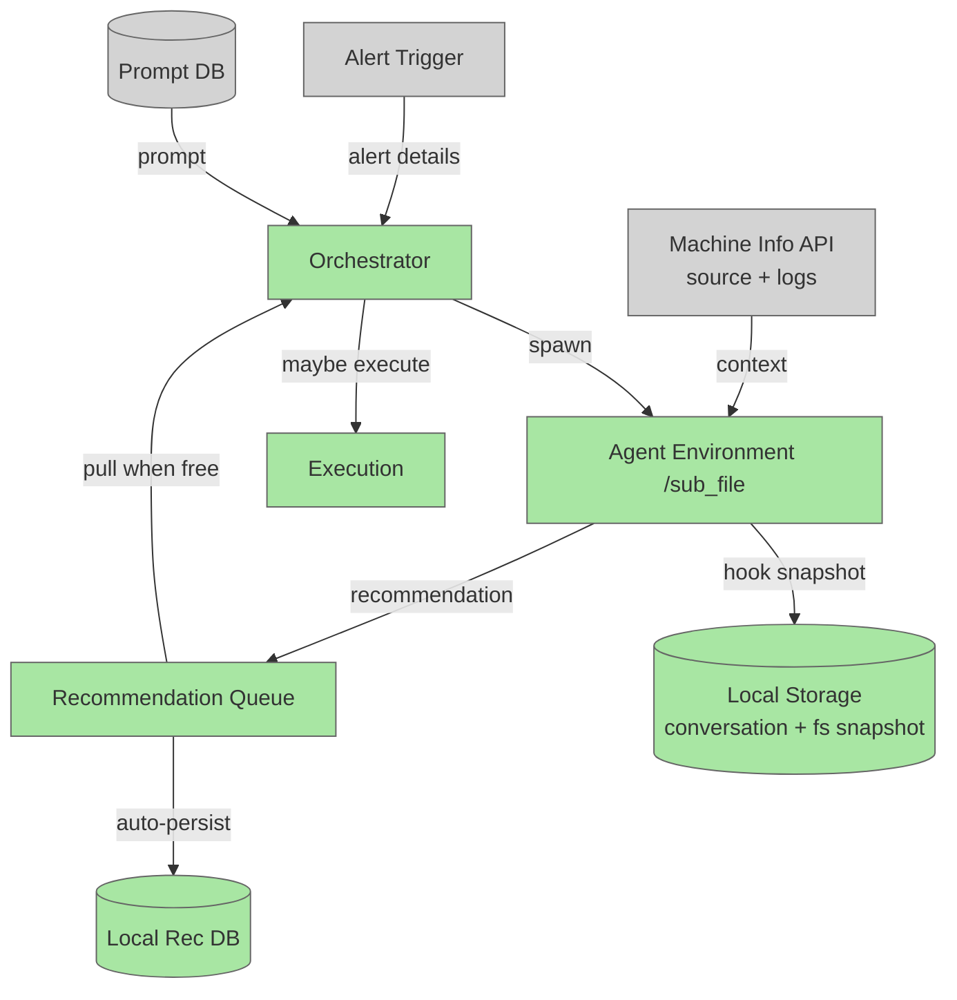

# High Level Plan — Agent Orchestration System

## System Intent

- What is being built: A system that turns high-level alerts into autonomously-run agents whose recommendations are queued, tracked, and selectively executed by an orchestrator.
- Primary consumer(s): _TODO — ops/on-call humans + the orchestrator runtime_
- Boundary (black-box scope only): _TODO_

## Components (each gets its own sub-plan)

1. **Orchestrator** — receives alerts, spins up agents (prompt from DB + alert details), pulls from the recommendation queue when free, possibly executes recommendations. → `01_orchestrator_plan.md`
2. **Agent Environment** — isolated agent process running from `/sub_file`, with its own filesystem, that writes recommendations to the queue. Hook snapshots conversation + filesystem to local storage. → `02_agent_environment_plan.md`
3. **Recommendation Queue** — recommendations are appended, auto-persisted to a local DB for tracking, and pulled by the orchestrator when able. → `03_recommendation_queue_plan.md`

## High-Level Diagram

## Open Questions / TODO

- Alert source + schema → see `04_dummy_alert_queue_plan.md` (dummy test source; real source TBD)
- _TODO — prompt DB shape and selection logic_
- _TODO — execution policy (auto vs human-gated)_
- _TODO — language / runtime / deployment target_
