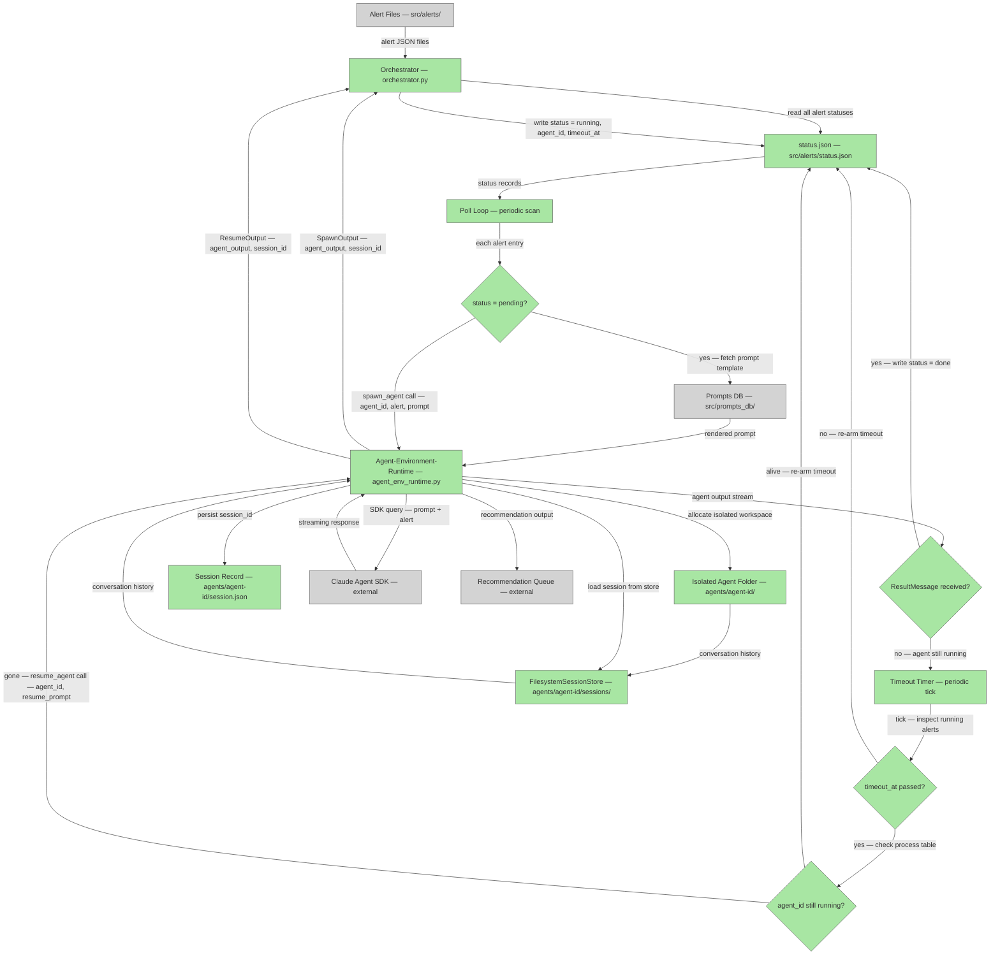

# Plan — Orchestrator

## System Intent

### Core Responsibility

The orchestrator is the main process that drives alert processing end-to-end. It watches the `src/alerts/` directory for alert JSON files, routes each alert through the agent-environment-runtime (see `docs/plans/2026-06-14-agent-environment-runtime.md`), and tracks execution state so that no alert is dropped — even when an agent crashes or loses its process.

The orchestrator does not contain agent logic. Its only jobs are: pick up alerts, hand them to agents, track state, and recover stalled work.

---

### Alert Schema

Each alert file in `src/alerts/` is a JSON object with at minimum:

```json
{
  "date": "YYYY-MM-DD",
  "title": "Human-readable title",
  "description": "What the agent should do",
  "machine": 101
}
```

Alert status is tracked externally in `src/alerts/status.json` (not embedded in the alert file itself). The status record for an alert includes:

```json
{
  "alert_file": "alert_001.json",
  "status": "pending" | "running" | "done",
  "agent_id": "<UUID>",           // set when status transitions to "running"
  "timeout_at": "<ISO timestamp>" // set when status transitions to "running"
}
```

---

### Alert Status Lifecycle (State Machine)

```
[alert file appears in src/alerts/]
         |
         v
      PENDING  ──── orchestrator picks up alert, selects prompt from prompts_db,
         |          calls spawn_agent(agent_id, alert, prompt) via agent-environment-runtime
         |
         v
      RUNNING  ──── status.json updated with: agent_id (UUID), timeout_at (now + timeout_interval)
         |
         |─── (happy path) agent finishes, ResultMessage received ──────────────────────────┐
         |                                                                                   v
         |─── (timeout fires, agent_id still running) ──── no-op, re-arm timeout           DONE
         |
         |─── (timeout fires, agent_id is NOT running) ──── call resume_agent(agent_id)
                    |
                    v
                RUNNING  ──── session.json + FilesystemSessionStore used to re-enter conversation
                    |
                    └──── (agent finishes) ──── DONE
```

**State transition rules:**
- `pending → running`: only when `spawn_agent()` returns successfully with a `session_id`.
- `running → done`: only when the agent's SDK query yields a `ResultMessage`.
- `running → running` (re-arm): when the timeout fires but the agent process is still alive.
- `running → running` (resume): when the timeout fires and the agent process is gone; `resume_agent()` is called and the timeout is re-armed.
- There is no `failed` state in v1 — unrecoverable errors are logged and the alert remains `running` for manual inspection.

---

### Key Decision Points

1. **Which prompt to use**: The orchestrator maps each alert to a prompt template from `src/prompts_db/`. The mapping is driven by the alert's `title` or `description` fields. The rendered prompt is passed verbatim to `spawn_agent()`.

2. **When to spawn vs. skip**: On startup and on each poll cycle, the orchestrator scans `status.json`. Alerts with `status: "pending"` (or absent from status.json entirely) are eligible to spawn. Alerts already `running` or `done` are skipped.

3. **Timeout check**: The orchestrator runs a periodic timer (configurable interval). On each tick it reads `status.json` and inspects every `running` alert whose `timeout_at` has passed. For each stalled alert it checks whether the `agent_id` corresponds to a live process. If the process is gone, it calls `resume_agent()`.

4. **Process liveness check**: The orchestrator tracks spawned agent processes (e.g., as `asyncio.Task` handles or OS PIDs, depending on how the SDK spawns them). An agent_id is "no longer running" when its task/process has exited or when no entry for it exists in the running process table.

5. **Concurrency**: The orchestrator may have multiple agents running simultaneously (one per alert). Each agent is fully isolated in its own `agents/<agent-id>/` folder with its own `FilesystemSessionStore`.

---

### Integration with Agent-Environment-Runtime

The orchestrator delegates all agent lifecycle management to the two functions defined in `docs/plans/2026-06-14-agent-environment-runtime.md`:

| Orchestrator need | Runtime call | What it returns |
|---|---|---|
| Start a new agent for a pending alert | `spawn_agent(agent_id, alert, prompt)` | `SpawnOutput { agent_output, session_id }` |
| Resume a stalled agent after timeout | `resume_agent(agent_id, resume_prompt)` | `ResumeOutput { agent_output, session_id }` |

Session state (conversation history) is stored in `agents/<agent-id>/sessions/` via `FilesystemSessionStore`. The `session_id` is persisted in `agents/<agent-id>/session.json` so the orchestrator can pass it back to the runtime on resume.

The orchestrator does not interact with the Claude Agent SDK directly — that boundary belongs entirely to the agent-environment-runtime layer.


## Stage Gate Tracker

- [x] Stage 1 Mermaid approved
- [ ] Stage 2 Flows approved
- [ ] Stage 3 Logs + Deployment approved or skipped

## Mermaid Diagram



## Flows

- Flow naming rule: `### Flow: \`<flowname>\``
- `N/A` for test files means explicit no-test-required waiver (not a missing mapping).

### Global Types

```txt
Alert {
  date:        string   — ISO date string, e.g. "2026-06-14"
  title:       string   — human-readable title used to select prompt template
  description: string   — natural language instruction for the agent
  machine:     integer  — numeric machine identifier the agent will target
}

StatusRecord {
  alert_file:  string            — filename of the alert, e.g. "alert_001.json"
  status:      "pending"
             | "running"
             | "done"
  agent_id:    string | null     — UUID; set when status transitions to "running"
  timeout_at:  string | null     — ISO timestamp; set when status transitions to "running"
}

SpawnOutput {
  agent_output: string   — the agent's final text output / recommendation
  session_id:   string   — UUID captured from SDK ResultMessage.session_id
}

ResumeOutput {
  agent_output: string   — the agent's continuation output
  session_id:   string   — session_id from resumed conversation (may differ from input)
}

StandardError {
  message: string   — human-readable description of what went wrong
}
```

---

### Flow: `ingestAlert`
- Test files: `tests/test_orchestrator.py`
- Core files: `orchestrator.py` — `ingest_alert()`, `src/alerts/`, `src/prompts_db/`

#### Intent

Read a new alert JSON file from `src/alerts/`, look up a matching prompt template from `src/prompts_db/` based on the alert's `title` field, and produce a fully rendered prompt string that can be passed to `spawnAgent`. This flow is the entry gate: it validates that the alert is well-formed and that a usable prompt template exists before any agent is launched.

#### Paths

| path | input | output | path-type | notes |
| --- | --- | --- | --- | --- |
| `ingestAlert.success` | `Alert` (parsed from alert file) | rendered `prompt: string` | happy path | template resolved, alert block appended, ready for spawnAgent |
| `ingestAlert.no-template` | `Alert` with unrecognized title | `StandardError` | error | no matching template in prompts_db; alert stays `pending` for manual triage |
| `ingestAlert.malformed-alert` | file that is not valid JSON or missing required fields | `StandardError` | error | logged and skipped; status.json not updated |

#### Steps

1. **Read and parse the alert file.** Load the JSON from `src/alerts/<alert_file>` and validate that `date`, `title`, `description`, and `machine` fields are all present. If any required field is missing or the file is not valid JSON, emit a `StandardError` and skip this alert without touching `status.json`.

2. **Select a prompt template from `src/prompts_db/`.** Scan `src/prompts_db/` for `.md` files whose filename or heading matches the alert's `title` (case-insensitive substring match). If no match is found, emit a `StandardError`; if multiple candidates match, pick the highest-ranked by filename sort order and log a warning.

3. **Render the prompt.** Read the selected template's full text and append the alert as a fenced JSON block under a `## Alert` heading. This combined string is the `prompt` that will be forwarded to `spawnAgent` — no further transformation happens downstream.

4. **Return the rendered prompt.** Hand `{ alert, prompt }` back to the orchestrator's main poll loop. The orchestrator then transitions the alert's `StatusRecord` to `"pending"` in `status.json` (if not already present) and calls `spawnAgent`.

---

### Flow: `spawnAgent`
- Test files: `tests/test_orchestrator.py`
- Core files: `orchestrator.py` — `spawn_agent()`, agent-environment-runtime (`agent_env_runtime.py`)

#### Intent

Launch a fresh Claude Agent SDK session for a pending alert by delegating to the agent-environment-runtime's `spawn_agent()` function. The orchestrator's role in this flow is narrow: generate a unique `agent_id`, call the runtime, and on success write a `"running"` `StatusRecord` (with `agent_id` and `timeout_at`) into `status.json`. All SDK interaction and session persistence happen inside the runtime layer.

#### Paths

| path | input | output | path-type | notes |
| --- | --- | --- | --- | --- |
| `spawnAgent.success` | `{ agent_id, alert, prompt }` | `SpawnOutput` | happy path | runtime creates agent folder, wires SessionStore, queries SDK to ResultMessage; status set to `"running"` |
| `spawnAgent.workdir-collision` | `agent_id` that already has a folder on disk | `StandardError` | error | orchestrator generates a fresh UUID and retries once before logging and skipping |
| `spawnAgent.runtime-error` | any exception from `agent_env_runtime.spawn_agent()` | `StandardError` | error | logged; status remains `"pending"` so next poll cycle retries |
| `spawnAgent.already-running` | alert whose `StatusRecord.status` is already `"running"` | no-op | skip path | poll loop guards: skip alerts not in `"pending"` state before calling this flow |

#### Steps

1. **Generate a unique `agent_id`.** Create a UUID4 string that will serve as both the key in `status.json` and the folder name `agents/<agent-id>/`. Log the mapping between alert file and agent_id before making any external calls so the pairing is always recoverable from logs even on crash.

2. **Delegate to the agent-environment-runtime.** Call `await agent_env_runtime.spawn_agent({ agent_id, alert, prompt })`. The runtime handles folder creation, `FilesystemSessionStore` wiring, SDK query, and `session.json` persistence inside `agents/<agent-id>/`. The orchestrator receives a `SpawnOutput` on success.

3. **Update `status.json` on success.** Write (or overwrite) the `StatusRecord` for this alert with `status: "running"`, the assigned `agent_id`, and `timeout_at = now + TIMEOUT_INTERVAL`. This write must be atomic (write to a temp file then rename) so a crash between steps cannot leave `status.json` in a half-written state.

4. **Arm the timeout.** Register the `agent_id` and its `timeout_at` in the orchestrator's in-memory running-agent table so the timeout timer can inspect it on the next tick without re-reading `status.json` on every cycle.

---

### Flow: `consumeRecommendation`
- Test files: `tests/test_orchestrator.py`
- Core files: `orchestrator.py` — `consume_recommendation()`, `src/alerts/status.json`

#### Intent

After an agent finishes (the runtime returns a `SpawnOutput` or `ResumeOutput`), the orchestrator extracts the agent's output and transitions the alert's `StatusRecord` to `"done"`. This flow is intentionally passive in v1: it records the recommendation and closes the loop without executing any downstream action, leaving a clean hook for future consumers (e.g., a queue or webhook) to extend.

#### Paths

| path | input | output | path-type | notes |
| --- | --- | --- | --- | --- |
| `consumeRecommendation.success` | `{ agent_id, agent_output }` from `SpawnOutput` or `ResumeOutput` | `StatusRecord` with `status: "done"` | happy path | output logged; status.json updated atomically |
| `consumeRecommendation.status-write-error` | IO error writing `status.json` | `StandardError` | error | logged; orchestrator may retry on next poll tick; alert remains `"running"` with original `timeout_at` |
| `consumeRecommendation.duplicate-done` | `agent_id` whose status is already `"done"` | no-op | skip path | idempotent guard; logs a warning and exits without modifying `status.json` |

#### Steps

1. **Receive the agent output.** Accept the `agent_output` string from `SpawnOutput` (or `ResumeOutput` on a resumed run). Log the full output keyed by `agent_id` and `alert_file` so the recommendation is durably recorded even before `status.json` is updated.

2. **Guard against duplicate completion.** Read the current `StatusRecord` for this `agent_id` from `status.json`. If `status` is already `"done"`, log a warning and return immediately without any write — this prevents double-transitions if a timeout tick and a normal result arrive close together.

3. **Transition status to `"done"`.** Write the updated `StatusRecord` (set `status: "done"`, leave `agent_id` and `timeout_at` in place for audit purposes) to `status.json` using an atomic temp-file-rename. Remove the `agent_id` from the orchestrator's in-memory running-agent table so the timeout timer stops inspecting it.

4. **Emit a structured log entry.** Write a single log line in the format `consumeRecommendation | done | { alert_file, agent_id, output_length }` so downstream monitoring can detect completions without parsing the full output. In v2 this step is where a queue push or webhook call would be inserted.

## Logs

_TODO_

## Deployment

_TODO_
